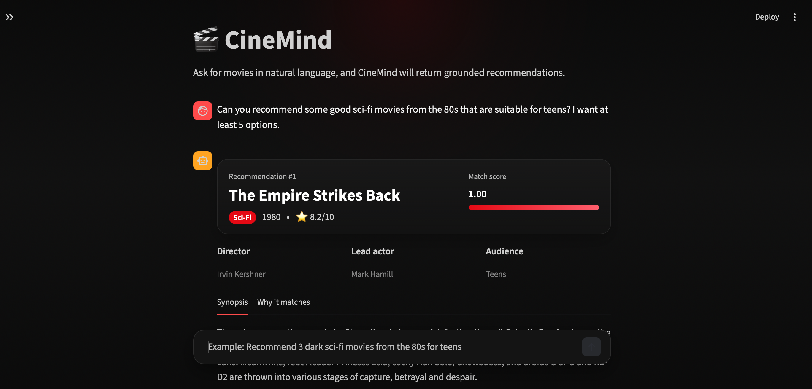

# 🎬 CineMind

Build **CineMind**, an LLM-based movie recommender that:

- accepts natural-language user preference
- retrieves matching movies from a PostgreSQL database
- uses an LLM to rank and explain recommendations
- returns structured recommendations in a strict schema



## External/API-facing

- `RecommendRequest`
- `RecommendationResponse`

## Internal Domain

- `ParsedPreferences`
- `MovieRecord`
- `MovieRecommendation`

## Install PostgreSQL (macOS)

If you already use Homebrew:

```bash
brew update
brew install postgresql@16
````

### Start PostgreSQL

```bash
brew services start postgresql@16
```

### Verify installation

```bash
psql --version
```

### ✅ Step 1 — Verify PostgreSQL is running

Run:

```bash
brew services list
````

You should see something like this:

```bash
postgresql@16  started  ...
````

If it says started → good

If not:

```bash
brew services start postgresql@16
````

### ✅ Step 2 — Connect to PostgreSQL

Try:

```bash
psql postgres
````

If it works, you will see:

```bash
postgres=#
```

### ✅ Step 3 — Create your database

Inside `psql`, run:

```SQL
CREATE DATABASE cinemind;
```

Then:

```SQL
\l
```

You should see `cinemind` in the list.

### ✅ Step 4 — (Important) Create a user

Still inside `psql`:

```SQL
CREATE USER cinemind_user WITH PASSWORD 'password';
ALTER USER cinemind_user WITH SUPERUSER;
```

👉 For local dev, SUPERUSER is fine and simpler.

### ✅ Step 5 — Test connection as that user

Exit:

```SQL
\q
```

Then, run:

```SQL
psql -U cinemind_user -d cinemind
```

If it connects, perfect.

---

Best validation mindset for CineMind

Think in terms of boundaries:

- Boundary 1 — external input

    Validate `RecommendRequest`

- Boundary 2 — LLM structured output

    Validate `ParsedPreferences`

- Boundary 3 — DB retrieval output

    Validate or construct `MovieRecord`

- Boundary 4 — final recommender output

    Validate `RecommendationResponse`

---

We should create a small yet disiplined test campaing for intent parser.

---

- keep your current **intent parser agent**
- add a deterministic **PostgreSQL retrieval service**
- wrap both in one **Intent + Retrieval orchestration layer**
- return a typed `RetrievalResult`

---

## What Agent 2 should do?

Input:

- original user query
- `RetrievalResult`
- resolved final count

Output:

- `RecommendationResponse`

Responsibilities:

- stay grounded in provided candidates only
- pick the strongest matches to the user's query
- generate short, useful reasons
- return structured output
